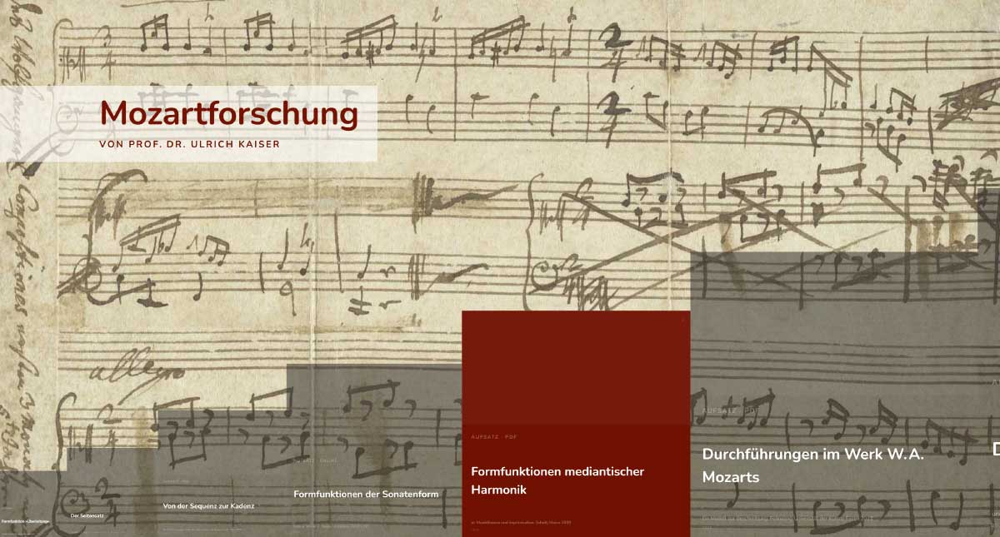

## mozartforschung.de

[Website](http://mozartforschung.de) mit Beiträgen zur Mozartfoschung von Ulrich Kaiser.

Alle Forschungsbeiträge stehen unter der jeweils angegebenen Creative-Commons-Lizenz. Die folgende Buchpublikation war bis 2013 im Bärenreiter-Verlag erhältlich und wird hier bereitgestellt (Open Access):

Ulrich Kaiser, *Die Notenbücher der Mozarts als Grundlage der Analyse von W. A. Mozarts Kompositionen 1761−1767*, Kassel 2007, 22013 (mit Korrekturen im Selbstverlag).

